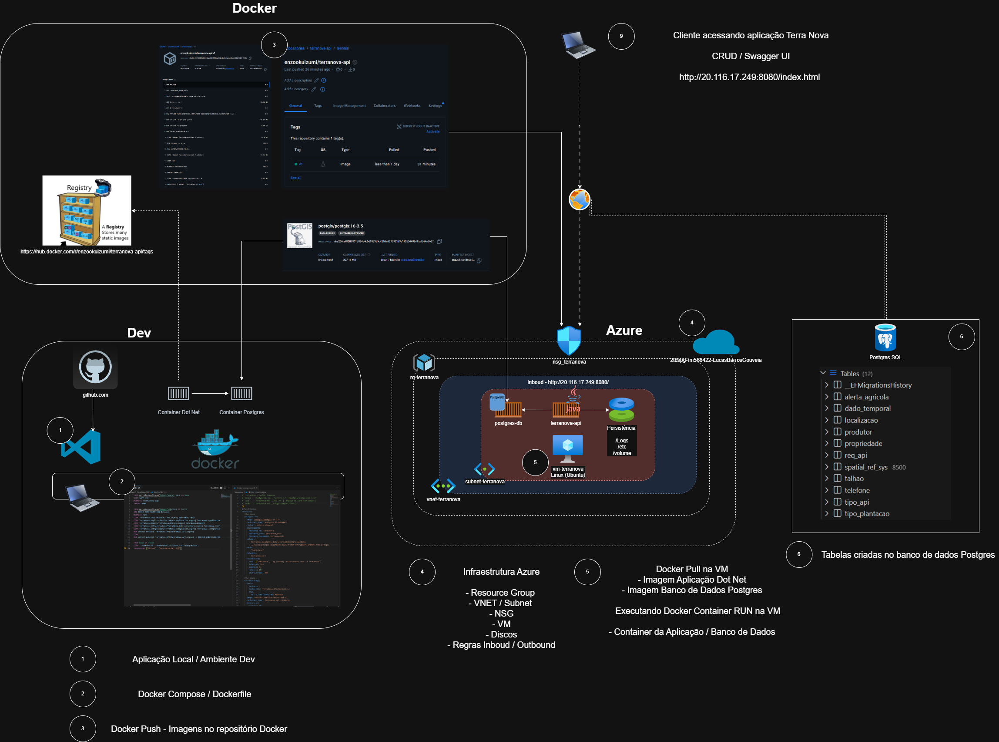

# 🌾 TerraNova API - DevOps Tools & Cloud Computing


# 👥 Integrantes da Equipe

| Nome | RM |
|------|------|
| Enzo Okuizumi Miranda de Souza | 561432 |
| Gustavo Keiji Okada | 563428 |
| Lucas Barros Gouveia | 566422 |
| Luna de Carvalho Guimarães | 562290 |
| Milton Jakson de Sousa Marcelino | 564836 |

## 📂 Repositório GitHub

[Repositório GitHub](https://github.com/Global-Solution-Space/DevOps-Tools-Cloud-Computing) | [Vídeo Demonstrativo]() 

## 🚀 Descrição da Solução Proposta

O **TerraNova** é uma solução tecnológica voltada para a gestão do agronegócio, permitindo o cadastro e monitoramento estruturado de **Produtores**, **Propriedades**, **Talhões** e **Tipos de Plantação**.

Esta entrega contempla a modernização da infraestrutura da API (desenvolvida em **.NET 10**) através da conteinerização com **Docker**. O ambiente foi projetado para rodar de forma isolada na nuvem, contendo dois serviços principais integrados em uma mesma rede virtual (**Bridge**):

### 📦 Container da Aplicação (App)

Executa a API do TerraNova utilizando diretrizes de segurança, operando com usuário não privilegiado e em um diretório de trabalho customizado (`/terranova-app`).

### 🗄️ Container do Banco de Dados (DB)

Executa o **PostgreSQL 16 com PostGIS 3.5** (imagem `postgis/postgis:16-3.5`), persistindo as informações de todo o ecossistema agrícola em um volume nomeado, garantindo a integridade dos dados independente do ciclo de vida do container. A extensão PostGIS é habilitada automaticamente no primeiro start via `sql/00_postgis_extension.sql`.

---

## 🏗️ Desenho Macro da Arquitetura

Abaixo está a representação da arquitetura macro da solução na nuvem, detalhando a comunicação entre os containers, exposição de portas, volumes e o fluxo de requisições.


---

## 🛠️ Tecnologias e Configurações dos Containers

| Configuração                | Valor                                                           |
| --------------------------- | --------------------------------------------------------------- |
| Linguagem/Framework         | C# / .NET 10 (ASP.NET Core)                                     |
| Banco de Dados              | PostgreSQL 16 + PostGIS 3.5 (`postgis/postgis:16-3.5`)         |
| Porta Exposta da API        | 8080                                                            |
| Porta Exposta do Banco      | 5432                                                            |
| Diretório de Trabalho (App) | `/terranova-app`                                                |
| Usuário de Execução (App)   | `app` (Não-root)                                                |
| Container da API            | `terranova-api-rm561432`                                        |
| Container do Banco          | `postgres-db-rm561432`                                          |
| Variáveis de Ambiente       | `ASPNETCORE_ENVIRONMENT`, `ConnectionStrings__TerraNovaPostgres` e `SatVegApiToken` |

### Por que PostgreSQL + PostGIS (e não Oracle Spatial)?

- **Instalação trivial** no Docker: a imagem `postgis/postgis:16-3.5` já vem com a extensão PostGIS pré-instalada. Sem necessidade de instalar nada manualmente nem configurar `MDSYS`/`USER_SDO_GEOM_METADATA` no schema.
- **Integração nativa com .NET**: o provider `Npgsql.EntityFrameworkCore.PostgreSQL.NetTopologySuite` mapeia o tipo `NetTopologySuite.Geometries.Point` para `geometry(Point, 4326)` **automaticamente**, e o EF Core gera a coluna PostGIS na migration sem nenhum script SQL manual.
- **Performance**: PostGIS é reconhecido mundialmente como o motor espacial mais rápido e eficiente. É o padrão de mercado para startups, aplicações cloud-native e grandes sistemas de GIS.
- **Custo**: 100% open-source. Oracle Enterprise com Spatial é caríssimo.

---

# 🚀 Como Executar o Projeto (How To)

Siga as instruções abaixo para realizar o deploy da aplicação e do banco de dados na sua máquina ou em uma instância de nuvem.

## 1️⃣ Clonar o Repositório

Abra o terminal e execute o comando abaixo para baixar o projeto:

```bash
git clone https://github.com/Global-Solution-Space/DevOps-Tools-Cloud-Computing.git
cd DevOps-Tools-Cloud-Computing
cd TerraNova
```

> ℹ️ O `docker-compose.yml` está versionado dentro da pasta `TerraNova/`, por isso entramos nela antes de executar os comandos do Docker.

## 2️⃣ Subir Postgres+PostGIS e a API

```bash
docker compose up -d --build
```

Na **primeira execução**, o container `postgres-db-rm561432`:
1. Cria o banco `terranova` com usuário `terranova_user`.
2. Executa automaticamente o script `sql/00_postgis_extension.sql` (mapeado em `/docker-entrypoint-initdb.d/`) que faz `CREATE EXTENSION IF NOT EXISTS postgis;`.
3. A API aplica automaticamente as migrations do Entity Framework no banco PostgreSQL/PostGIS durante o startup.

## 3️⃣ Conferir o status dos containers

Depois do build, confirme que a API e o banco estão rodando:

```bash
docker compose ps
```

> ℹ️ A migration inicial já está versionada no projeto. Na VM Ubuntu não é necessário instalar o SDK do .NET nem executar `dotnet ef` manualmente para criar as tabelas.

## 4️⃣ Exibir os Logs dos Containers

```bash
docker compose logs -f
```

---

# 🔍 Evidências de Execução (Validação)

Conforme os requisitos do projeto, abaixo estão os comandos para validar a estrutura interna dos containers e a persistência de dados.

## 📌 Validação do Container da Aplicação (.NET)

Acesse o terminal interativo do container da API para comprovar o usuário e o diretório de trabalho configurados no Dockerfile:

```bash
# Acessa o container da API (nome definido no docker-compose: terranova-api)
docker container exec -it terranova-api-rm561432 /bin/bash

# Comprovação do usuário não privilegiado (deve retornar 'app')
whoami

# Comprovação do diretório de trabalho (deve retornar '/terranova-app')
pwd

# Listar os arquivos compilados da aplicação
ls -la

# Sair do container
exit
```

---

# 🧪 Comandos CRUD

Abaixo estão os comandos `curl` para exercitar a API após o `docker compose up -d --build` estar rodando. A API expõe os endpoints no prefixo `api/` e a interface interativa do Swagger está disponível em `http://localhost:8080`.

> 🔁 **Ordem recomendada**: como as entidades possuem chaves estrangeiras entre si, cadastre primeiro as entidades que não precisam de IDs anteriores e vá avançando. Os exemplos abaixo usam `jq` para capturar o `id` retornado em cada `CREATE` e reutilizar esse valor automaticamente nos comandos seguintes.

> 🧰 **Pré-requisito para não digitar IDs manualmente**: execute os comandos em Bash, na mesma sessão de terminal, com `jq` instalado. Na VM Linux criada pelo `azure-cli-script.sh`, o `jq` já é instalado automaticamente; em uma VM Ubuntu manual, use `sudo apt-get update -y && sudo apt-get install -y jq`.

> 🌍 Substitua `localhost:8080` pelo IP público da VM (`$PUBLIC_IP:8080`) caso esteja executando no Azure.

```bash
API_URL="http://localhost:8080"
```

## 1️⃣ Criar um Tipo de Plantação (sem ID anterior)

```bash
# CREATE
TIPO_PLANTACAO_ID=$(curl -fsS -X POST "$API_URL/api/tipoplantacao" \
  -H "Content-Type: application/json" \
  -d '{
    "tipoPlant": "Soja"
  }' | jq -r '.id // .Id')

echo "TIPO_PLANTACAO_ID=$TIPO_PLANTACAO_ID"

# READ ALL
curl -fsS "$API_URL/api/tipoplantacao"

# READ BY ID
curl -fsS "$API_URL/api/tipoplantacao/$TIPO_PLANTACAO_ID"

# UPDATE
curl -fsS -X PUT "$API_URL/api/tipoplantacao/$TIPO_PLANTACAO_ID" \
  -H "Content-Type: application/json" \
  -d '{
    "tipoPlant": "Soja Transgênica"
  }'

```

## 2️⃣ Criar uma Localização (sem ID anterior)

```bash
# CREATE
LOCALIZACAO_ID=$(curl -fsS -X POST "$API_URL/api/localizacao" \
  -H "Content-Type: application/json" \
  -d '{
    "latitude":  -23.5505,
    "longitude": -46.6333
  }' | jq -r '.id // .Id')

echo "LOCALIZACAO_ID=$LOCALIZACAO_ID"

# READ ALL
curl -fsS "$API_URL/api/localizacao"

# READ BY ID
curl -fsS "$API_URL/api/localizacao/$LOCALIZACAO_ID"

# UPDATE
curl -fsS -X PUT "$API_URL/api/localizacao/$LOCALIZACAO_ID" \
  -H "Content-Type: application/json" \
  -d '{
    "latitude":  -22.9068,
    "longitude": -43.1729
  }'

```

## 3️⃣ Criar um Produtor (sem ID anterior; já cadastra o telefone)

```bash
# CREATE (cadastra produtor + telefone na mesma chamada)
PRODUTOR_ID=$(curl -fsS -X POST "$API_URL/api/produtor" \
  -H "Content-Type: application/json" \
  -d '{
    "nome":   "João da Silva",
    "email":  "joao.silva@terranova.com",
    "senha":  "senha123",
    "telefoneContato": "11987654321"
  }' | jq -r '.id // .Id')

echo "PRODUTOR_ID=$PRODUTOR_ID"

# READ ALL
curl -fsS "$API_URL/api/produtor"

# READ BY ID
curl -fsS "$API_URL/api/produtor/$PRODUTOR_ID"

# READ BY EMAIL
curl -fsS "$API_URL/api/produtor/by-email?email=joao.silva@terranova.com"

# UPDATE
curl -fsS -X PUT "$API_URL/api/produtor/$PRODUTOR_ID" \
  -H "Content-Type: application/json" \
  -d '{
    "nome":   "João da Silva Jr.",
    "email":  "joao.jr@terranova.com",
    "senha":  "novaSenha123",
    "telefoneContato": "11999998888"
  }'

```

## 4️⃣ Criar uma Propriedade (requer ID de Produtor + Localização)

```bash
# CREATE
PROPRIEDADE_ID=$(curl -fsS -X POST "$API_URL/api/propriedade" \
  -H "Content-Type: application/json" \
  -d "$(jq -n \
    --arg produtorId "$PRODUTOR_ID" \
    --arg localizacaoId "$LOCALIZACAO_ID" \
    '{
      nome: "Fazenda Boa Vista",
      tamanhoTotal: 150.75,
      produtorId: $produtorId,
      localizacaoId: $localizacaoId
    }')" | jq -r '.id // .Id')

echo "PROPRIEDADE_ID=$PROPRIEDADE_ID"

# READ ALL
curl -fsS "$API_URL/api/propriedade"

# READ BY ID
curl -fsS "$API_URL/api/propriedade/$PROPRIEDADE_ID"

# READ BY PRODUTOR
curl -fsS "$API_URL/api/propriedade/by-produtor/$PRODUTOR_ID"

# UPDATE
curl -fsS -X PUT "$API_URL/api/propriedade/$PROPRIEDADE_ID" \
  -H "Content-Type: application/json" \
  -d "$(jq -n \
    --arg produtorId "$PRODUTOR_ID" \
    --arg localizacaoId "$LOCALIZACAO_ID" \
    '{
      nome: "Fazenda Boa Vista - Sede",
      tamanhoTotal: 175.00,
      produtorId: $produtorId,
      localizacaoId: $localizacaoId
    }')"

```

## 5️⃣ Criar um Talhão (requer ID de TipoPlantação + Propriedade + Localização)

```bash
# CREATE
TALHAO_ID=$(curl -fsS -X POST "$API_URL/api/talhao" \
  -H "Content-Type: application/json" \
  -d "$(jq -n \
    --arg tipoPlantacaoId "$TIPO_PLANTACAO_ID" \
    --arg propriedadeId "$PROPRIEDADE_ID" \
    --arg localizacaoId "$LOCALIZACAO_ID" \
    '{
      nomeTalhao: "Talhão 01 - Soja",
      volumArea: 45.50,
      tipoPlantacaoId: $tipoPlantacaoId,
      propriedadeId: $propriedadeId,
      localizacaoId: $localizacaoId
    }')" | jq -r '.id // .Id')

echo "TALHAO_ID=$TALHAO_ID"

# READ ALL
curl -fsS "$API_URL/api/talhao"

# READ BY ID
curl -fsS "$API_URL/api/talhao/$TALHAO_ID"

# READ BY PROPRIEDADE
curl -fsS "$API_URL/api/talhao/by-propriedade/$PROPRIEDADE_ID"

# READ BY TIPO PLANTACAO
curl -fsS "$API_URL/api/talhao/by-tipo-plantacao/$TIPO_PLANTACAO_ID"

# UPDATE
curl -fsS -X PUT "$API_URL/api/talhao/$TALHAO_ID" \
  -H "Content-Type: application/json" \
  -d "$(jq -n \
    --arg tipoPlantacaoId "$TIPO_PLANTACAO_ID" \
    --arg propriedadeId "$PROPRIEDADE_ID" \
    --arg localizacaoId "$LOCALIZACAO_ID" \
    '{
      nomeTalhao: "Talhão 01 - Soja (Renomeado)",
      volumArea: 50.00,
      tipoPlantacaoId: $tipoPlantacaoId,
      propriedadeId: $propriedadeId,
      localizacaoId: $localizacaoId
    }')"

```

## 7️⃣ Criar um Tipo de API (sem ID anterior)

```bash
# CREATE
TIPO_API_ID=$(curl -fsS -X POST "$API_URL/api/tipoapi" \
  -H "Content-Type: application/json" \
  -d '{
    "nomeTipoApi": "NASA POWER"
  }' | jq -r '.id // .Id')

echo "TIPO_API_ID=$TIPO_API_ID"

# READ ALL
curl -fsS "$API_URL/api/tipoapi"

# READ BY ID
curl -fsS "$API_URL/api/tipoapi/$TIPO_API_ID"

# UPDATE
curl -fsS -X PUT "$API_URL/api/tipoapi/$TIPO_API_ID" \
  -H "Content-Type: application/json" \
  -d '{
    "nomeTipoApi": "NASA POWER"
  }'
```

## 8️⃣ Criar uma Requisição de API (requer ID de Tipo API + Talhão)

```bash
# CREATE
# tipoParam: 0 = NVDI/SATVEG, 1 = PRECTOTCORR/NASA POWER
REQ_API_ID=$(curl -fsS -X POST "$API_URL/api/reqapi" \
  -H "Content-Type: application/json" \
  -d "$(jq -n \
    --arg tipoApiId "$TIPO_API_ID" \
    --arg talhaoId "$TALHAO_ID" \
    '{
      tipoParam: 1,
      tipoApiId: $tipoApiId,
      talhaoId: $talhaoId
    }')" | jq -r '.id // .Id')

echo "REQ_API_ID=$REQ_API_ID"

# READ ALL
curl -fsS "$API_URL/api/reqapi"

# READ BY ID
curl -fsS "$API_URL/api/reqapi/$REQ_API_ID"

# READ BY TALHÃO
curl -fsS "$API_URL/api/reqapi/talhao/$TALHAO_ID"
```

## 9️⃣ Criar um Alerta Agrícola (requer ID de Talhão)

```bash
# CREATE
# nivelAlerta: 0 = Baixo, 1 = Medio, 2 = Alto, 3 = Critico
ALERTA_ID=$(curl -fsS -X POST "$API_URL/api/alertaagricola" \
  -H "Content-Type: application/json" \
  -d "$(jq -n \
    --arg talhaoId "$TALHAO_ID" \
    '{
      titulo: "Risco de estiagem",
      descricao: "Monitorar baixa umidade e necessidade de irrigação no talhão.",
      nivelAlerta: 2,
      talhaoId: $talhaoId
    }')" | jq -r '.id // .Id')

echo "ALERTA_ID=$ALERTA_ID"

# READ ALL
curl -fsS "$API_URL/api/alertaagricola"

# READ BY ID
curl -fsS "$API_URL/api/alertaagricola/$ALERTA_ID"

# READ BY TALHÃO
curl -fsS "$API_URL/api/alertaagricola/talhao/$TALHAO_ID"

# UPDATE
curl -fsS -X PUT "$API_URL/api/alertaagricola/$ALERTA_ID" \
  -H "Content-Type: application/json" \
  -d "$(jq -n \
    --arg talhaoId "$TALHAO_ID" \
    '{
      titulo: "Risco de estiagem atualizado",
      descricao: "Acompanhar chuva acumulada e revisar planejamento de irrigação.",
      nivelAlerta: 3,
      talhaoId: $talhaoId
    }')"

# RESOLVER
curl -fsS -X PATCH "$API_URL/api/alertaagricola/$ALERTA_ID/resolver"

# REABRIR
curl -fsS -X PATCH "$API_URL/api/alertaagricola/$ALERTA_ID/reabrir"
```

## 🔟 Consultar Dados Temporais (gerados pela Req API)

```bash
# READ ALL
curl -fsS "$API_URL/api/dadotemporal"

# READ BY TALHÃO
curl -fsS "$API_URL/api/dadotemporal/talhao/$TALHAO_ID"

# READ BY REQ API
curl -fsS "$API_URL/api/dadotemporal/req-api/$REQ_API_ID"

# READ BY ID
DADO_TEMPORAL_ID=$(curl -fsS "$API_URL/api/dadotemporal/req-api/$REQ_API_ID" | jq -r '.[0].id // .[0].Id // empty')

if [ -n "$DADO_TEMPORAL_ID" ]; then
  curl -fsS "$API_URL/api/dadotemporal/$DADO_TEMPORAL_ID"
else
  echo "Nenhum dado temporal retornado para a requisição $REQ_API_ID"
fi
```

> ℹ️ `DadoTemporal` não possui `POST`, `PUT` ou `DELETE` próprios no controller. Os registros são criados automaticamente ao executar `POST /api/reqapi` e são removidos em cascata ao remover a requisição correspondente.

## 🧹 Remover os registros criados (ordem segura para DELETE)

```bash
# DELETE ALERTA AGRÍCOLA
curl -fsS -X DELETE "$API_URL/api/alertaagricola/$ALERTA_ID"

# DELETE REQ API (remove os dados temporais associados)
curl -fsS -X DELETE "$API_URL/api/reqapi/$REQ_API_ID"

# DELETE TIPO API
curl -fsS -X DELETE "$API_URL/api/tipoapi/$TIPO_API_ID"

# DELETE TALHÃO
curl -fsS -X DELETE "$API_URL/api/talhao/$TALHAO_ID"

# DELETE PROPRIEDADE
curl -fsS -X DELETE "$API_URL/api/propriedade/$PROPRIEDADE_ID"

# DELETE PRODUTOR
curl -fsS -X DELETE "$API_URL/api/produtor/$PRODUTOR_ID"

# DELETE LOCALIZAÇÃO
curl -fsS -X DELETE "$API_URL/api/localizacao/$LOCALIZACAO_ID"

# DELETE TIPO DE PLANTAÇÃO
curl -fsS -X DELETE "$API_URL/api/tipoplantacao/$TIPO_PLANTACAO_ID"
```

## 📋 Tabela Resumo de Endpoints

## Tabela tipo_plantacao

| Verbo     | Rota                                              | Descrição                              |
| --------- | ------------------------------------------------- | -------------------------------------- |
| `GET`     | `/api/tipoplantacao`                              | Lista todos os tipos de plantação      |
| `GET`     | `/api/tipoplantacao/{id}`                         | Busca tipo de plantação por ID         |
| `POST`    | `/api/tipoplantacao`                              | Cria um tipo de plantação              |
| `PUT`     | `/api/tipoplantacao/{id}`                         | Atualiza um tipo de plantação          |
| `DELETE`  | `/api/tipoplantacao/{id}`                         | Remove um tipo de plantação            |

## Tabela localizacao

| Verbo     | Rota                                              | Descrição                              |
| --------- | ------------------------------------------------- | -------------------------------------- |
| `GET`     | `/api/localizacao`                                | Lista todas as localizações            |
| `GET`     | `/api/localizacao/{id}`                           | Busca localização por ID               |
| `POST`    | `/api/localizacao`                                | Cria uma localização                   |
| `PUT`     | `/api/localizacao/{id}`                           | Atualiza uma localização               |
| `DELETE`  | `/api/localizacao/{id}`                           | Remove uma localização                 |

## Tabela produtor

| Verbo     | Rota                                              | Descrição                              |
| --------- | ------------------------------------------------- | -------------------------------------- |
| `GET`     | `/api/produtor`                                   | Lista todos os produtores              |
| `GET`     | `/api/produtor/{id}`                              | Busca produtor por ID                  |
| `GET`     | `/api/produtor/by-email?email={email}`            | Busca produtor por e-mail              |
| `POST`    | `/api/produtor`                                   | Cria um produtor (com telefone)        |
| `PUT`     | `/api/produtor/{id}`                              | Atualiza um produtor                   |
| `DELETE`  | `/api/produtor/{id}`                              | Remove um produtor                     |

## Tabela propriedade

| Verbo     | Rota                                              | Descrição                              |
| --------- | ------------------------------------------------- | -------------------------------------- |
| `GET`     | `/api/propriedade`                                | Lista todas as propriedades            |
| `GET`     | `/api/propriedade/{id}`                           | Busca propriedade por ID               |
| `GET`     | `/api/propriedade/by-produtor/{produtorId}`       | Lista propriedades de um produtor      |
| `POST`    | `/api/propriedade`                                | Cria uma propriedade                   |
| `PUT`     | `/api/propriedade/{id}`                           | Atualiza uma propriedade               |
| `DELETE`  | `/api/propriedade/{id}`                           | Remove uma propriedade                 |

## Tabela talhao

| Verbo     | Rota                                              | Descrição                              |
| --------- | ------------------------------------------------- | -------------------------------------- |
| `GET`     | `/api/talhao`                                     | Lista todos os talhões                 |
| `GET`     | `/api/talhao/{id}`                                | Busca talhão por ID                    |
| `GET`     | `/api/talhao/by-propriedade/{propriedadeId}`      | Lista talhões de uma propriedade       |
| `GET`     | `/api/talhao/by-tipo-plantacao/{tipoPlantacaoId}` | Lista talhões de um tipo de plantação  |
| `POST`    | `/api/talhao`                                     | Cria um talhão                         |
| `PUT`     | `/api/talhao/{id}`                                | Atualiza um talhão                     |
| `DELETE`  | `/api/talhao/{id}`                                | Remove um talhão                       |

## Tabela tipo_api

| Verbo     | Rota                                              | Descrição                              |
| --------- | ------------------------------------------------- | -------------------------------------- |
| `GET`     | `/api/tipoapi`                                    | Lista todos os tipos de API            |
| `GET`     | `/api/tipoapi/{id}`                               | Busca tipo de API por ID               |
| `POST`    | `/api/tipoapi`                                    | Cria um tipo de API                    |
| `PUT`     | `/api/tipoapi/{id}`                               | Atualiza um tipo de API                |
| `DELETE`  | `/api/tipoapi/{id}`                               | Remove um tipo de API                  |

## Tabela req_api

| Verbo     | Rota                                              | Descrição                              |
| --------- | ------------------------------------------------- | -------------------------------------- |
| `GET`     | `/api/reqapi`                                     | Lista todas as requisições de API      |
| `GET`     | `/api/reqapi/{id}`                                | Busca requisição de API por ID         |
| `GET`     | `/api/reqapi/talhao/{talhaoId}`                   | Lista requisições por talhão           |
| `POST`    | `/api/reqapi`                                     | Cria uma requisição de API externa     |
| `DELETE`  | `/api/reqapi/{id}`                                | Remove uma requisição e seus dados     |

## Tabela alerta_agricola

| Verbo     | Rota                                              | Descrição                              |
| --------- | ------------------------------------------------- | -------------------------------------- |
| `GET`     | `/api/alertaagricola`                             | Lista todos os alertas agrícolas       |
| `GET`     | `/api/alertaagricola/{id}`                        | Busca alerta por ID                    |
| `GET`     | `/api/alertaagricola/talhao/{talhaoId}`           | Lista alertas por talhão               |
| `POST`    | `/api/alertaagricola`                             | Cria um alerta agrícola                |
| `PUT`     | `/api/alertaagricola/{id}`                        | Atualiza um alerta agrícola            |
| `PATCH`   | `/api/alertaagricola/{id}/resolver`               | Marca um alerta como resolvido         |
| `PATCH`   | `/api/alertaagricola/{id}/reabrir`                | Reabre um alerta resolvido             |
| `DELETE`  | `/api/alertaagricola/{id}`                        | Remove um alerta agrícola              |

## Tabela dado_temporal

| Verbo     | Rota                                              | Descrição                              |
| --------- | ------------------------------------------------- | -------------------------------------- |
| `GET`     | `/api/dadotemporal`                               | Lista todos os dados temporais         |
| `GET`     | `/api/dadotemporal/{id}`                          | Busca dado temporal por ID             |
| `GET`     | `/api/dadotemporal/talhao/{talhaoId}`             | Lista dados temporais por talhão       |
| `GET`     | `/api/dadotemporal/req-api/{reqApiId}`            | Lista dados temporais por requisição   |

> 💡 **Dica**: você também pode usar a interface gráfica do Swagger em `http://localhost:8080` para testar todas as rotas com formulários automáticos.

---

## 📌 Validação do Banco de Dados e Persistência (PostgreSQL + PostGIS)

Acesse o terminal do container do banco para validar o relacionamento do CRUD de gestão agrícola e testar as funções espaciais do PostGIS:

```bash
# Acessa o container do banco (nome definido no docker-compose: postgres-db)
docker container exec -it postgres-db-rm561432 bash

# Acessa o psql (credenciais configuradas no docker-compose: terranova_user / terranova123)
psql -U terranova_user -d terranova

# Confirma que a extensão PostGIS está habilitada
\dx postgis

# Lista as tabelas e confirma que a coluna 'coordenadas' é geometry(Point, 4326)
\d localizacao

# Comprova o relacionamento do domínio agrícola
SELECT * FROM produtor;
SELECT * FROM propriedade;
SELECT * FROM talhao;

# Consulta espacial: devolve a coordenada (longitude, latitude) em texto
SELECT id_localizacao, ST_AsText(coordenadas) FROM localizacao;

# Função espacial do PostGIS: distância em metros entre duas localizações
SELECT ST_DistanceSphere(
    (SELECT coordenadas FROM localizacao LIMIT 1),
    (SELECT coordenadas FROM localizacao OFFSET 1 LIMIT 1)
) AS distancia_metros;
```
